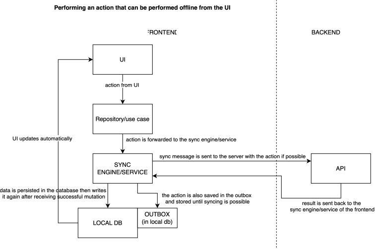
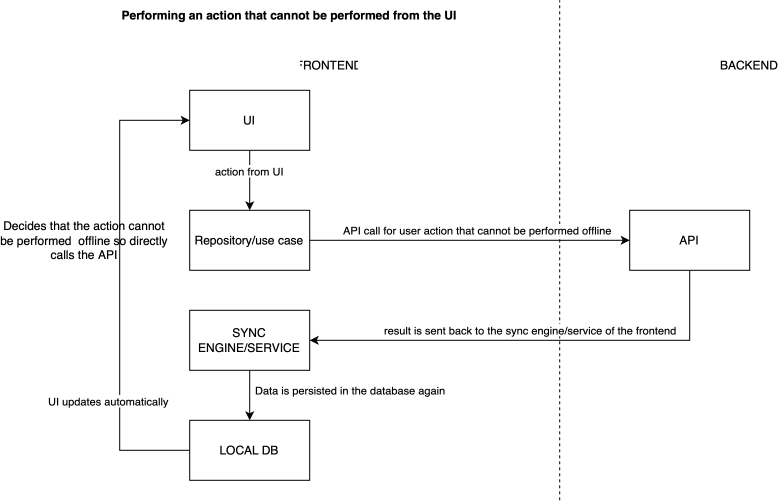
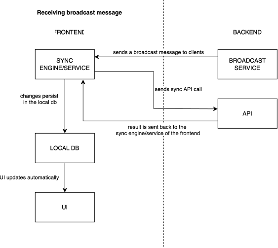

# Frontend–backend kommunikáció és offline szinkronizáció

A dokumentumban tömören szerepel, hogy a különböző események hogyan vannak szinkronizálva a frontend és a backend között.

## Offline is végrehajtható művelet

Ez az az eset, amikor a felhasználó egy olyan eseményt hajt végre, amit offline is megtehet (például chore teljesítése, chore címének módosítása, új chore létrehozása, on-demand chore szükségessé tétele).

A lokális módosítás megtörténik az adatbázisban, ami azonnali UI frissítést vált ki. Emellett a sync services elmenti az eseményt az Outbox táblában (lehetőleg egy tranzakcióban). Amennyiben lehetséges (van például internetelérés) a sync service elküldi az Outboxba írt eseményt a backend API-jának, majd az visszaküldi a választ. Siker esetén a visszaadott adat (ami adott eestben lehet ugyanaz is) a frontend adatbázisába kerül írásra.

## Cannot perform offline action

Ez az az eset, amikor a felhasználó egy olyan eseményt hajt végre, amit offline nem tehet meg (például egy szerepkör jogosultságainak módosítása, egy háztartásbeli tag eltávolítása).

Ezek a műveletek nem kerülnek az Outbox-ba. Ha nincs internetkapcsolat, a művelet nem hajtható végre. A UI ezt letilthatja, vagy jelezheti, hogy internetkapcsolat szükséges.

## Broadcast message fogadása

Amikor az alkalmazás online, a backend jelezheti, hogy újabb adat érhető el, vagy valaki más módosítást hajtott végre.

A szinkronizációs kurzor alapján a sync engine eldönti, hogy szükség van-e az adott rekord szinkronizációjára vagy sem.

## Komponensek felelőssége

- UI:
  - Felhasználói interakció és megjelenítés

- Repository / Use Case:
  - Belépési pont az alkalmazási műveletekhez

- Lokális tár (SwiftData):
  - A UI által használt lokális állapot

- Outbox:
  - Még nem megerősített offline is végrehajható műveletek

- Sync engine
  - Outbox mutation-ök elküldése
  - Backend változások letöltése
  - Szinkronizációs kurzot kezelése

- Backend
  - Autoritatív business logic
  - Jogosultságkezelés
  - Validáció
  - Konfliktus kezelés

## Megjegyzés

- Szinkronizáció kurzor segítségével van számontartva, hogy mi a legfrissebb állapot. (Itt ez egy háztartást jelent.)
- Ha túl sok idő telik el szinkronizációk között, vagy nagyon sok változás történt, akkor egy teljes refetch hatásosabb, mint a külön-külön szinkronizáció.
